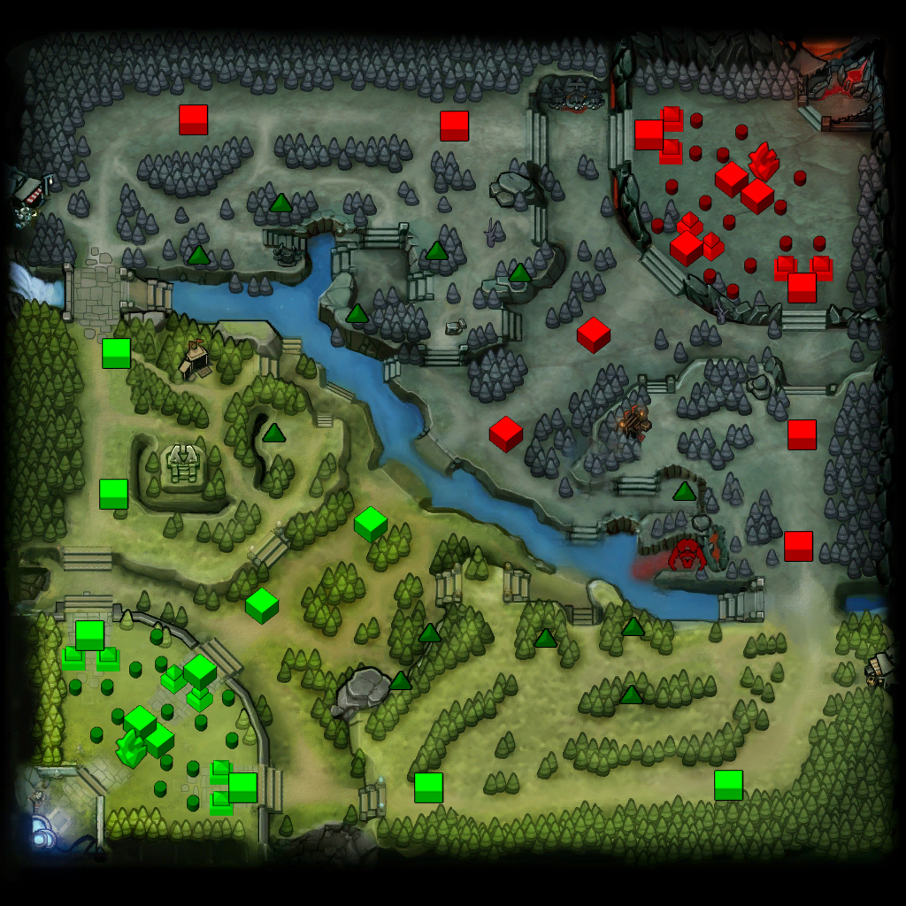

<style>
.title-slide {
  background-color: #FFFFFF; /* #EDE0CF; ; #CA9F9D*/
}
.title-slide  {
  color: #000000;
}

  .reveal h3 {
      color: #c1d192;
      text-align: left;
      padding-bottom: 10px;
      font-family: Impact, sans-serif;
  }
  .reveal h4 {
      color: #c1d192;
      text-align: left;
      padding-bottom: 10px;
      font-family: Impact, sans-serif;
  }
  .reveal h5 {
      color: #c1d192;
      text-align: left;
      padding-bottom: 10px;
      font-family: Impact, sans-serif;
  }
</style>


```{r, setup, include=FALSE}
knitr::opts_chunk$set(cache=TRUE,echo=FALSE,message=FALSE,comment="")

library(dplyr)
library(ggplot2)
library(ROCR)


load(file="C:\\Users\\jeck\\Downloads\\presentation.rda")
testing <- aggregate(solo_competitive_rank~match_id+side,data=klart, mean)

hehe <- klart[klart$midreal==TRUE,]
hehe2 <- klart[klart$safereal==TRUE,]
hehe3 <- klart[klart$offreal==TRUE,]
hehe4 <- klart[klart$junglereal==TRUE,]
hehe5 <- klart[klart$midreal==FALSE | klart$safereal==FALSE | klart$offreal==FALSE | klart$junglereal==FALSE,]


test_mid <- merge(testing,hehe, by = c("match_id","side"))
testsafe <- merge(testing,hehe2, by = c("match_id","side"))
testoff <- merge(testing,hehe3, by = c("match_id","side"))
testjungle <- merge(testing,hehe4, by = c("match_id","side"))
testunknown <- merge(testing,hehe5, by = c("match_id","side"))

alla <- merge(testing, klart, by = c("match_id", "side"))


test_mid$diff <- (test_mid$solo_competitive_rank.y-test_mid$solo_competitive_rank.x)
testsafe$diff <- (testsafe$solo_competitive_rank.y-testsafe$solo_competitive_rank.x)
testoff$diff <- (testoff$solo_competitive_rank.y-testoff$solo_competitive_rank.x)
testjungle$diff <- (testjungle$solo_competitive_rank.y-testjungle$solo_competitive_rank.x)
testunknown$diff <- (testunknown$solo_competitive_rank.y-testunknown$solo_competitive_rank.x)

possar <- list(test_mid,testsafe,testoff,testjungle)
pos_list <- c("midspelare","safelanespelare","hardlanespelare","djungelspelare")

#logit <- function(x) {
#model <- model <- glm(win~diff, family=binomial(link='logit'), data=x)
#stargazer(model, apply.coef=exp, t.auto=F, p.auto=F, report = "vct*")
#print(summary(model))
#print("p-Värde:")
#coef(summary(model))[,4]
#print(coef(summary(model))[2,1])
#print(exp(coef(summary(model))[2,1]))
#}

#poss <- list(test_mid,testsafe,testoff,testjungle)
#lapply(poss, logit)

#logit(testoff)


logit <- function(x) {
model <- model <- glm(win~diff, family=binomial(link='logit'), data=x)
exp(cbind(coef(model), confint(model)))  
}

poss <- list(test_mid,testsafe,testoff,testjungle)
odds <- lapply(poss, logit)
ratios <- as.data.frame(do.call(rbind, odds))
#logit(testoff)
ratios <- ratios[-c(1,3,5,7),]
rownames(ratios) <- c("Middiff", "Safediff", "Hardlanediff", "Djungeldiff")
colnames(ratios) <- c("boxOdds", "boxCILow" ,"boxCIHigh")

boxLabels = c("Middiff", "Safediff", "Hardlanelanediff", "Djungeldiff")
ratios$yAxis = length(boxLabels):1


model <- glm(testoff$win~testoff$diff,family=binomial(link='logit'))

p <- predict(model,newdata=subset(testoff,select=c(13)),type='response')
pr <- prediction(p, testoff$win)
prf <- performance(pr, measure = "tpr", x.measure = "fpr")
#plot(prf,col="blue")
#title(main = "ROC kurva för hardlanespelare", xlab="", ylab="")
#abline(0,1)
auc <- performance(pr,"auc")
auc <- unlist(slot(auc, "y.values"))
# adding min and max ROC AUC to the center of the plot
minauc<-min(round(auc, digits = 2))
maxauc<-max(round(auc, digits = 2))
maxauct <- paste(c("AUC  = "),maxauc,sep="")
#plot(prf,col="blue")
#title(main = "ROC kurva för hardlanespelare", xlab="", ylab="")
#abline(0,1)
# legend(0.45,0.45,c(maxauct),border="white",cex=1.3, pt.cex=1,box.col = "white")


fitted.results <- ifelse(p > 0.5,1,0)
misClasificError <- mean(fitted.results != testoff$win)
# print(paste('Accuracy',1-misClasificError))
# 
acc.perf <- performance(pr, measure = "acc")
ind = which.max( slot(acc.perf, "y.values")[[1]] )
acc = slot(acc.perf, "y.values")[[1]][ind]
cutoff = slot(acc.perf, "x.values")[[1]][ind]
print(c(accuracy= acc, cutoff = cutoff))
#plot(acc.perf)

```

### Syfte & Frågeställning

<br><br>

MMRs och lanes betydelse för matchresultat

 
<br><br><br><br><br><br><br><br><br>

---

### Centrala begrepp

> - MMR - Skicklighetspoäng

> - Lanes - vägar emellan baserna

<br><br><br><br><br><br><br><br><br><br><br>

---

### Karta



---

### Data
<br><br><br><br><br><br><br><br><br><br><br><br><br><br>

---

### Metod
<br><br><br><br><br><br><br><br><br><br><br><br><br><br>

---

### Metod forts. ROC

```{r, echo=FALSE,fig.width=6.4,fig.height=6.4}

load(file="datapre.rda")
fit2 = glm(income ~.-relationship, family = binomial(logit), 
           data = data$train)
fitpreds = predict(fit2,newdata=data$val,type="response")
fitpred = prediction(fitpreds,data$val$income)
fitperf = performance(fitpred,"tpr","fpr")

plot(fitperf,col="blue",lwd=2,main="ROC-kurva exempel", cex = 25, ylab = "Andel Sant positiv", xlab= "Andel falskt positiv")
abline(0,1)

```

---

### Resultat mid

```{r, echo=FALSE,fig.width=6.4,fig.height=6.4}

ggplot(possar[[1]], aes(x=diff, y=win)) +
  geom_point() + stat_smooth(method="glm", method.args = list(family = binomial(link = "logit")), se=FALSE) +
  ggtitle(paste0("Logistisk regressionmodell ", pos_list[1])) +
  labs(x="MMR-differens mot laget", y="Vinstsannolikhet")  +
  theme_bw() +
  theme(panel.grid.minor = element_blank(), axis.line = element_line(colour = "black"),axis.text=element_text(size=13), axis.title=element_text(size=16), plot.title =  element_text(size = 18, face = "bold"))

```

---

### Resultat safelane

```{r, echo=FALSE,fig.width=6.4,fig.height=6.4}

ggplot(possar[[2]], aes(x=diff, y=win)) +
  geom_point() + stat_smooth(method="glm", method.args = list(family = binomial(link = "logit")), se=FALSE) +
  ggtitle(paste0("Logistisk regressionsmodell ", pos_list[2])) +
  labs(x="MMR-differens mot laget", y="Vinstsannolikhet")  +
  theme_bw() +
  theme(panel.grid.minor = element_blank(), axis.line = element_line(colour = "black"),axis.text=element_text(size=13), axis.title=element_text(size=16), plot.title =  element_text(size = 18, face = "bold"))
  

```

----

### Resultat hardlane

```{r, echo=FALSE,fig.width=6.4,fig.height=6.4}

ggplot(possar[[3]], aes(x=diff, y=win)) +
  geom_point() + stat_smooth(method="glm", method.args = list(family = binomial(link = "logit")), se=FALSE) +
  ggtitle(paste0("Logistisk regressionmodell ", pos_list[3])) +
  labs(x="MMR-differens mot laget", y="Vinstsannolikhet")  +
  theme_bw() +
  theme(panel.grid.minor = element_blank(), axis.line = element_line(colour = "black"),axis.text=element_text(size=13), axis.title=element_text(size=16), plot.title =  element_text(size = 18, face = "bold"))

```

---

### Resultat djungel

```{r, echo=FALSE,fig.width=6.4,fig.height=6.4}

ggplot(possar[[4]], aes(x=diff, y=win)) +
  geom_point() + stat_smooth(method="glm", method.args = list(family = binomial(link = "logit")), se=FALSE) +
  ggtitle(paste0("Logistisk regressionmodell ", pos_list[4])) +
  labs(x="MMR-differens mot laget", y="Vinstsannolikhet")  +
  theme_bw() +
  theme(panel.grid.minor = element_blank(), axis.line = element_line(colour = "black"),axis.text=element_text(size=13), axis.title=element_text(size=16), plot.title =  element_text(size = 18, face = "bold"))

```

---

### Resultat oddskvoter

```{r, echo=FALSE,fig.width=6.4,fig.height=6.4}

  nr <- nrow(ratios)  # find out how many rows all together
  with(ratios, {# this allows entering your commands more succinctly
    # first you could set up the plot so you can select the order of drawing
    plot(1:nr, boxOdds, ylim = c(0.9990, 1.001), type = 'n', xaxt = 'n', xlab = '', main="Oddskvot och 95% CL oberoende variabler", cex = 25, ylab = 'Oddskvot', frame.plot = TRUE, panel.first = grid(nx = NA, ny = NULL))
    arrows(1:nr, boxCILow, 1:nr, boxCIHigh, length = 0.05, angle = 90, code = 3, col = yAxis) 
    # you could use arrows above but you don't want ends so segments is easier
    #segments(1:nr, boxCILow, 1:nr, boxCIHigh, col = yAxis)
    # add your points
    points(1:nr, boxOdds, pch = 19, cex = 1)
    axis(1, seq(1, 4, by = 1), rownames(ratios))
  })
  abline(h = 1.0)

```

---

### Resultat ROC

```{r, echo=FALSE,fig.width=6.4,fig.height=6.4}

plot(prf,col="blue",lwd=2,main="ROC kurva hardlanespelare", cex = 25, ylab = "Andel sant positiv", xlab= "Andel falsk positiv")
abline(0,1)
 legend(0.45,0.45,c(maxauct),border="white",cex=1.3, pt.cex=1,box.col = "white")
```

---

### Slutsats

Vilken inverkan på matchresultatet har skillnaden i MMR emellan spelare i ett lag i förhållande till vilken lane spelaren oftast vistas på?

<br><br>

>  - Spelare med högre MMR än sina lagkamrater bör undvika spela på hardlane

<br><br><br><br><br><br><br>

---

### Diskussion
<br><br><br><br><br><br><br><br><br><br><br><br><br><br>

---
### Frågor?
<br><br><br><br><br><br><br><br><br><br><br><br><br><br>


