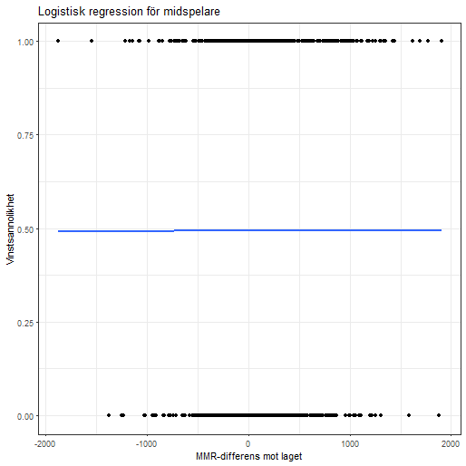
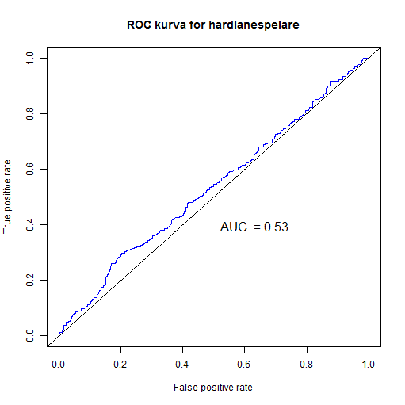
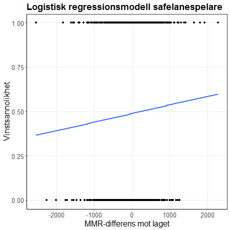
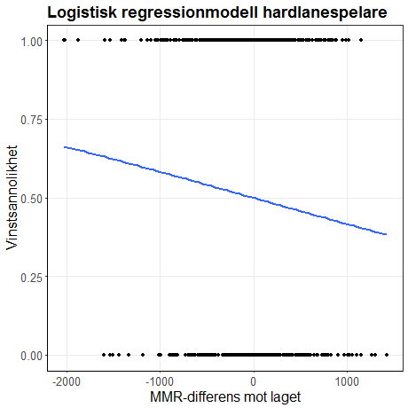
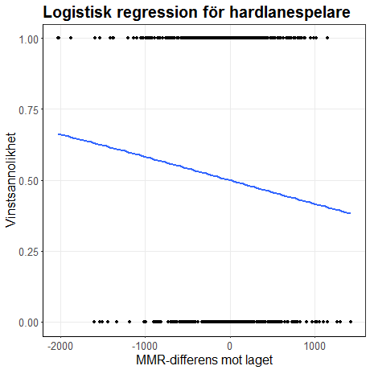
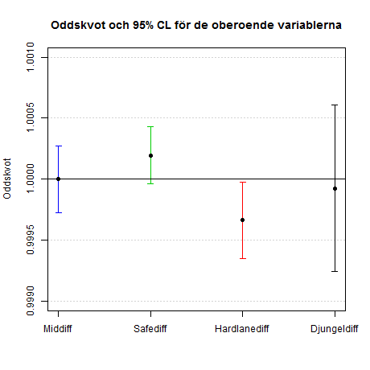
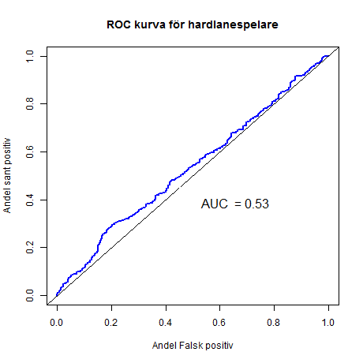

### Syfte & Fråge

- Vilka faktorer spelar storst roll gällande valet av favoritrestaurang?

- Till exempel hur påverkar , valet av favoritrestaurang.

          

---

### Centrala begrepp
              

---

### Centrala begrepp forts.
              

---

### Data
              

---

### Metod
              

---

### ROC

---

### Resultat mid

---

### Resultat safelane

----

### Resultat hardlane

---

### Resultat djungel

---

### Resultat oddskvoter

---

### Resultat ROC

---

### Slutsats
              

---

### Diskussion
              

---
### Frågor?
              

