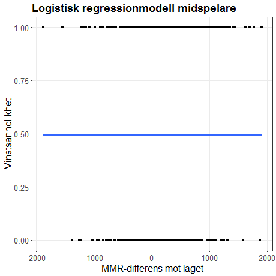

Syfte & Fråge

- Vilka faktorer spelar storst roll gällande valet av favoritrestaurang?

- Till exempel hur påverkar , valet av favoritrestaurang.

           

---

Minimap
                

---

Lane
                

---

Data
                

---

---
Resultat 2
                

----

Resultat 3
                

---

---

Slutsats
                

--- 
Diskussion
                

---
Frågor?
                

