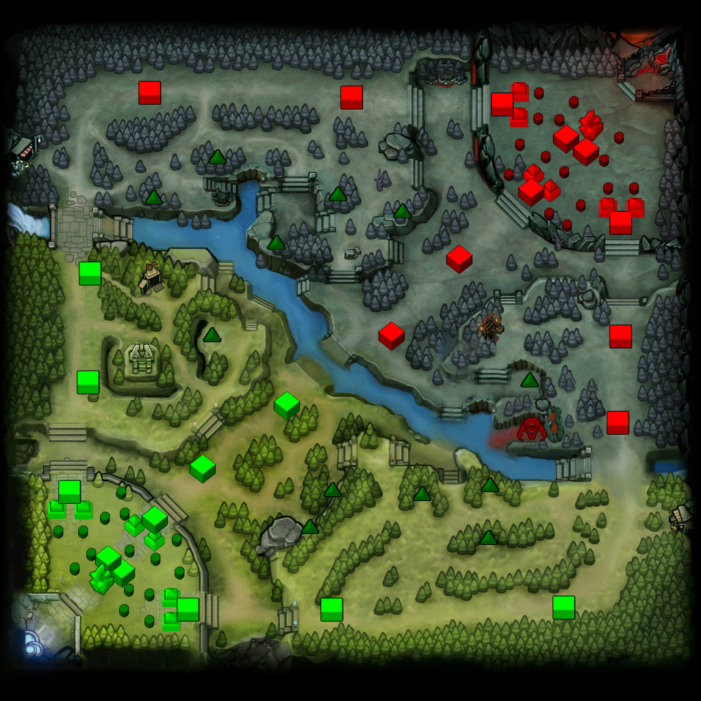
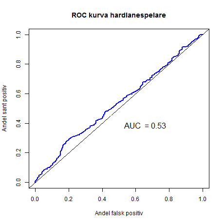

### Syfte & Frågeställning

  

Vilken inverkan på matchresultatet har skillnaden i MMR mellan spelare i
ett lag i förhållande till vilken lane spelaren oftast vistas på?

 
         

---

### Centrala begrepp

  - Dota2 - vad är det?

> - MMR - Skicklighetspoäng

> - Lanes - vägar emellan baserna

         

---

### Karta

---

### Data

   - Opendota

>  - Data från 7000 matcher

>  - MMR differens emellan laget och spelarna

>  - Alla spelare visar inte sin MMR

       

---

### Metod

Binär logistisk regression

>  - Receiver Operating Characteristic curve - ROC kurva 

           

---

### Metod forts. ROC

---

### Resultat mid

---

### Resultat safelane

----

### Resultat hardlane

---

### Resultat djungel

---

### Resultat oddskvoter

---

### Resultat ROC

---

### Slutsats

Vilken inverkan på matchresultatet har skillnaden i MMR emellan spelare i ett lag i förhållande till vilken lane spelaren oftast vistas på?

  

>  - Spelare med högre MMR än sina lagkamrater bör undvika spela på hardlane

       

---

### Diskussion

Bättre klassificering hade troligtvis gett ett mer signifikant resultat

>  - Svårt att klassifiera

>  - Proffsspelare skulle vara lättare att analysera men har liten variation i MMR

         

---
### Frågor?
              

